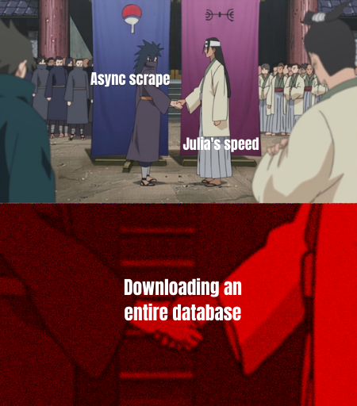

# Andha-Kanoon

This is a stateless asynchronous data scraping project using Julia. This small piece of code downloads all the pdfs available at [Indian Kanoon](https://indiankanoon.org/). As for the name of the repo, it means `Law is blind`.

<p align="center">
  
</p>

## Why Julia?

Python is easily one of the best choices we have for data-scraping. [Beautiful Soup](https://beautiful-soup-4.readthedocs.io/en/latest/) and [Scrapy](https://scrapy.org/) are one of the well tested and popular tools out there on the internet. But these tools had one little problem: they could not bypass the Cloudflare layer without heavy external libraries. So I decided to give [Julia](https://julialang.org/) a try. These were the main reasons that convinced me:

1. Julia's speed and composability.
2. Clean and concise CSS selector [Cascadia](https://github.com/andybalholm/cascadia).
3. One of the most comprehensive async explanations in [StackOverflow](https://stackoverflow.com/a/37287021).
4. An unique library for PDFs: [PDFIO.jl](https://github.com/sambitdash/PDFIO.jl).

## Setting Up

1. Download and set up [Julia](https://julialang.org/).
```console
mkdir -p ~/julia-1.6.3

wget https://julialang-s3.julialang.org/bin/linux/x64/1.5/julia-1.6.3-linux-x86_64.tar.gz\
        -O /tmp/julia.tar.gz

tar -xvzf /tmp/julia.tar.gz -C ~/julia-1.6.3 --strip-components 1

## Set up a symbolic link
ln -s ~/julia-1.6.3/bin/julia /usr/local/bin/

```
You should be able to use the `julia` command without any further configuration.

2. Clone the repo.
```console
git clone git@github.com:Dsantra92/Andha-Kanoon.git
cd Andha-Kanoon
```
3. Set up the packages.
```console
## Open the Julia REPL and press ] 
(@v1.6) pkg> activate .
(@v1.6) pkg> instantiate
```

4. Run the code.
```julia
julia> include("src/main.jl")
juila> download_all_pdf_for_all_courts()
```

## What makes this data extraction a bit special?

1. The maximum number of search results per query is 400. This implies that, for a broad search, most of the documents are not downloadable or viewable from the browser. So we optimize the query function to make sure that we get the maximum number of results. We can't every pdfs because some dates have more than 400 PDFs.

2. Light-weight and minimal dependencies.

## Problems

## Further developments

- [ ] Integrate PDFIO.jl to read PDFs.
- [ ] Make the code more scaleable and play with some `async` and `threads`.
- [ ] Make the proper API for extensive searching.
- [ ] More optimized and robust data scraping algorithm.
- [ ] A proper documentation.


## Note to all users

The [Indian Kanoon API](https://api.indiankanoon.org/) is behind a payroll. Since data scraping is still legal, you can easily pull up a terminal and download the documents you want. Unless and until it violates or breaches any restrictions or laws enforced by the lawful owners and compilers of these documents, this repository will be available as a public repository. As the author of this code, I do not claim ownership of the data. The license for this code can be found [here](LICENSE).
